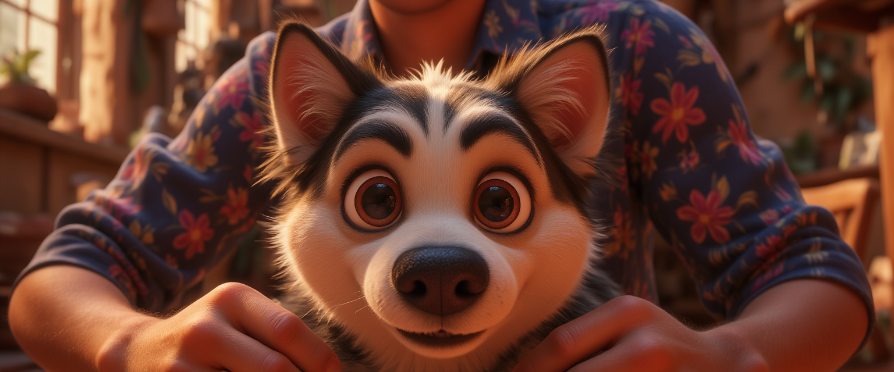
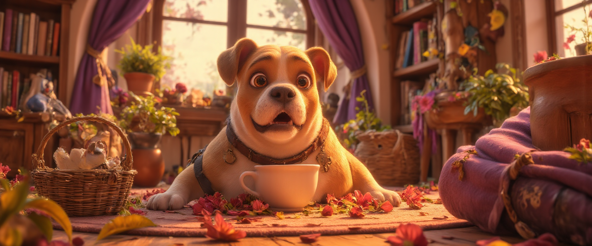
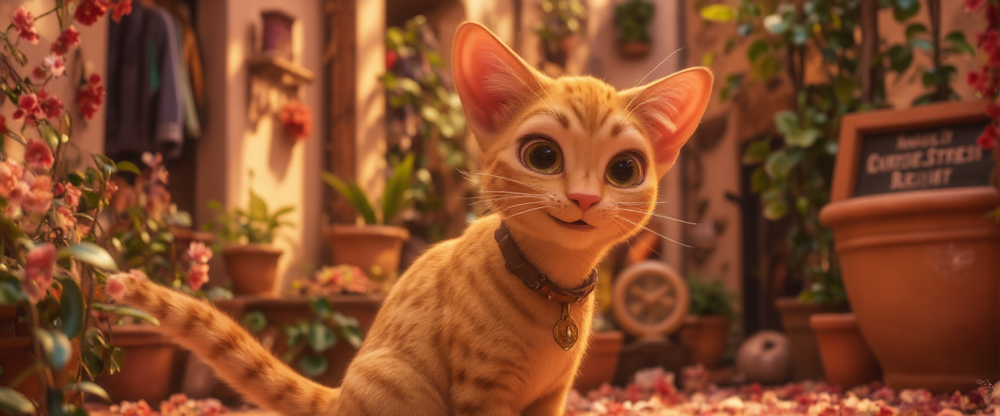
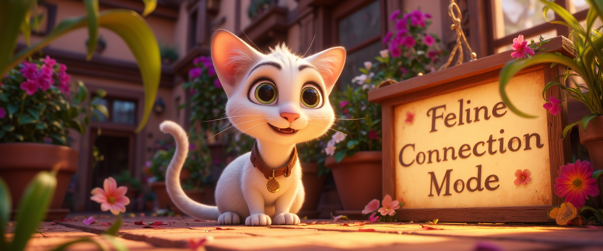
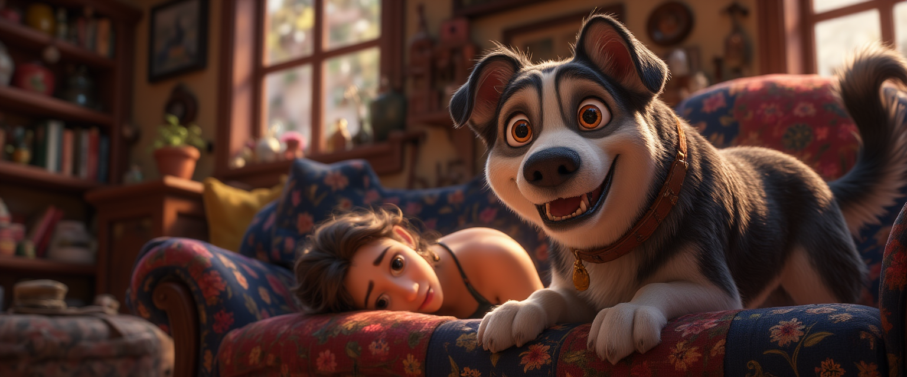
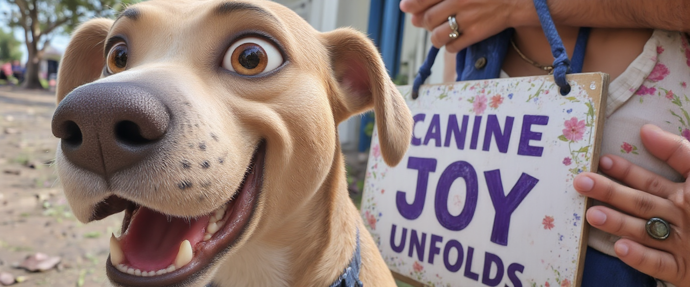
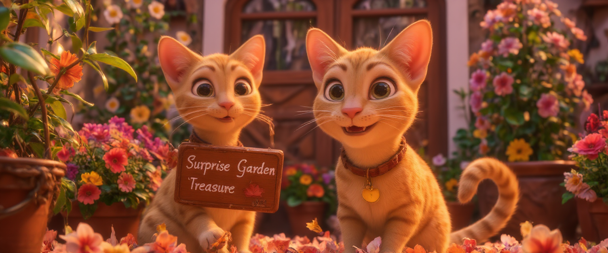
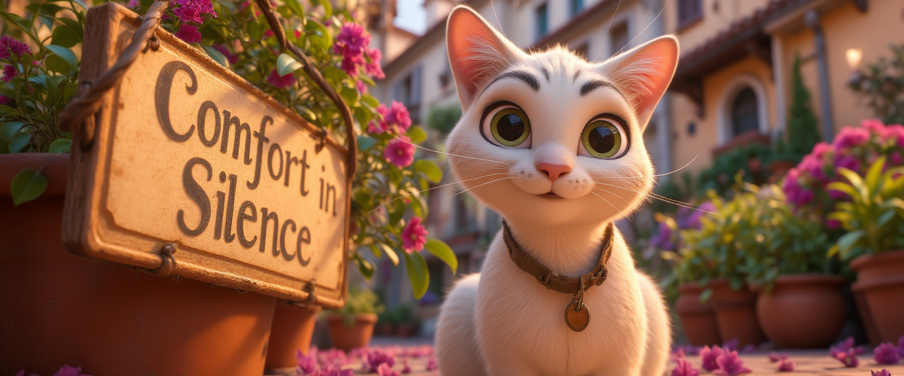

# Pet Adoption AI

**AI-generated promotional art for shelter pets.**

My wife volunteers at a local pet adoption clinic, and they were having trouble getting pets noticed. I was also looking for a real-world project to test out an end-to-end AI stack — Ollama for local LLM inference, Replicate for FLUX LoRA training, and Flask for tying it together. This was the result: a pipeline that takes a pet's adoption listing + photos, trains a custom model, and generates stylized artwork of that specific animal.

## What It Creates

Sample outputs from real shelter pets:

| Jackson | Honey | Yellow | Koda |
|---------|-------|--------|------|
|  |  |  |  |
|  |  |  |  |

*Each pet's LoRA was trained on 5-20 real photos, then used with style LoRAs (Pixar, Ghibli, etc.) to generate these.*

## How It Works

Four steps, orchestrated through a Flask web UI:

```
1. GATHER DATA      Paste the pet's adoption listing. Ollama (llama3) extracts
                    name, breed, age, personality traits, writes an adoption
                    story, and generates image prompts.

2. TRAIN A LORA     Upload 5-20 photos of the pet. The app trains a FLUX LoRA
                    on Replicate so the AI learns what this specific pet looks like.
                    (~15-20 min on a GPU-T4)

3. GENERATE ART     Using the trained LoRA + style LoRAs (Pixar, Ghibli, Lego,
                    hand-painted miniature), generates images of the pet in
                    various scenarios based on extracted personality traits.

4. CREATE MORE      A separate page lets you generate additional images with custom
                    prompts, different styles, and aspect ratios.
```

Everything is tracked in a per-pet JSON config, and you get an email with the results when it's done.

## The Web UI

- **Create Pet LoRA** - Paste the adoption description, upload photos, hit go. A live terminal shows progress via WebSocket.
- **Pet Directory** - Browse all processed pets, view their AI art and submission data.
- **Make New Images** - Pick a pet, write a custom prompt, choose a style LoRA (Pixar, Ghibli, etc.), and generate more images.

## Architecture

```
app.py                          Flask + SocketIO web server
0_run_all.py                    Pipeline orchestrator
1_gather_pet_data.py            Ollama-powered data extraction & story generation
2_train_a_lora.py               Replicate FLUX LoRA training
3_create_images_of_pet.py       Automated image generation from trained model
4_create_additional_images.py   On-demand image generation with custom prompts

utilities/
  ollama_utils.py               Local LLM management (install, serve, query)
  replicate_utils.py            Replicate API (model creation, training, inference)
  gmail_utils.py                Email notifications with image attachments
  fileio_utils.py               Temporary file hosting for training uploads
  file_zip_utils.py             Image packaging for upload
  archive_utils.py              Disk space management & output archiving

templates/
  base.html                     Bootstrap 5 layout with SocketIO progress
  create_lora.html              Pet submission form with live progress terminal
  create_images.html            Custom image generation with style controls
  view_pets.html                Gallery view of processed pets
```

## Setup

### Prerequisites

- Python 3.10+
- [Ollama](https://ollama.com/) installed locally
- A [Replicate](https://replicate.com/) account (for LoRA training + image generation)
- (Optional) Gmail app password for email notifications

### Installation

```bash
git clone https://github.com/tillo13/pet-adoption-ai.git
cd pet-adoption-ai

python -m venv venv
source venv/bin/activate
pip install -r requirements.txt

# Pull the local LLM for data extraction
ollama pull llama3

# Configure your API keys
cp .env.example .env
# Edit .env with your Replicate API token and other credentials
```

### Running

```bash
# Start the web UI
python app.py

# Opens at http://localhost:5001
```

Or run the pipeline directly from the command line:

```bash
# Edit GLOBAL_VARIABLES.py with the pet description, then:
python 0_run_all.py
```

## Configuration

Edit `GLOBAL_VARIABLES.py` to customize:

| Setting | Default | Description |
|---------|---------|-------------|
| `STEPS` | 1000 | LoRA training steps |
| `LORA_RANK` | 16 | LoRA rank (higher = more capacity) |
| `RESOLUTION` | "512, 768, 1024" | Training resolutions |
| `NUMBER_OF_FACTS` | 5 | Encouraging facts / image prompts to generate |
| `MODE` | "DEVELOPMENT" | Set to "PRODUCTION" for public models + HuggingFace push |
| `EMAIL_ON_COMPLETION` | True | Send email when generation finishes |

## Cost

Running on Replicate's GPU-T4 hardware:
- **LoRA training**: ~$1-2 per pet (15-20 min at ~$0.00055/sec)
- **Image generation**: ~$0.01-0.03 per image

Processing 7 pets with ~130 total generated images cost roughly $10-15.

## The Pets

This project processed 7 real shelter animals:

| Pet | Type | Images Generated |
|-----|------|-----------------|
| Jackson | Dog | 6 |
| Marina | Dog | 9 |
| Yellow | Cat | 35 |
| Koda | Cat | 10 |
| Mister White | Cat | 8 |
| Maybelline | Cat | 39 |
| Honey | Dog | 25 |

## Tech Stack

- **Local LLM**: Ollama + llama3 for text extraction and prompt generation
- **Image training**: Replicate API for FLUX LoRA fine-tuning
- **Image generation**: Replicate API with trained LoRA + style LoRAs
- **Web UI**: Flask + Flask-SocketIO + Bootstrap 5
- **File hosting**: file.io for ephemeral training image uploads
- **Notifications**: Gmail SMTP with optional GCP Secret Manager

## License

MIT
